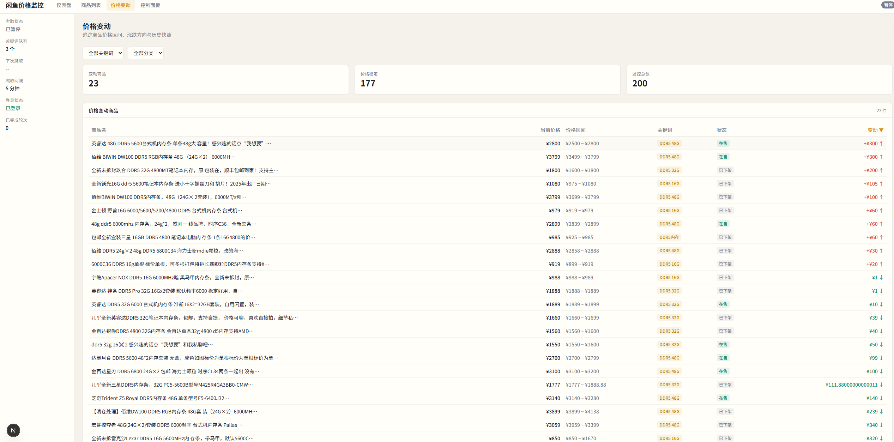
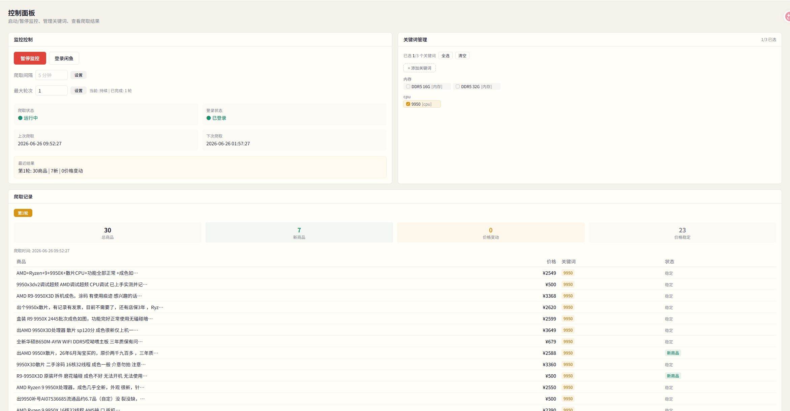

# 闲鱼价格监控工具

基于 Next.js 的闲鱼（Goofish）二手商品价格监控平台，自动爬取商品信息并追踪价格变化，支持 CSV 导出和数据管理。




## 功能特性

### 📊 数据仪表盘
- 商品总数、在售数量、价格快照数等关键指标
- 按分类统计价格分布（最低/最高/均价）
- 最近发现商品列表
- 价格变动商品追踪

### 🔍 商品列表
- 按关键词、分类、在售状态筛选
- 按价格、发现时间、状态排序
- 复选框批量选择
- **导出 CSV** — 按当前筛选条件导出商品及价格历史（扁平格式，价格变动去重）
- **删除管理** — 单个/批量/按关键词/按分类/清空全部（级联删除价格快照，二次确认）

### 📈 商品详情
- 商品信息卡片（标题、价格、卖家、地区、成色）
- Chart.js 价格趋势折线图
- 价格快照时间表

### 🕐 价格变动历史
- 筛选查看价格发生变化的商品
- 按关键词和分类过滤
- 变动商品与稳定商品分组展示

### ⚙️ 爬虫控制台
- 一键启动/暂停爬虫
- 管理搜索关键词（添加/删除/选择分类）
- 设置爬取间隔和轮次上限
- 实时查看爬取进度和结果
- Cookie 登录管理

## 实现方案

### 技术栈
| 层 | 技术 |
|---|---|
| 前端框架 | Next.js 16 (App Router) + React 19 + TypeScript |
| 样式 | Tailwind CSS v4 |
| 图表 | Chart.js + react-chartjs-2 |
| 数据库 | SQLite (better-sqlite3) |
| 爬虫引擎 | Playwright (Node.js) |

### 架构
- **Server Component** 负责数据获取（直接调用 better-sqlite3）
- **API Route** 处理写操作（爬虫控制、删除、导出）
- **Client Component** 处理交互逻辑（筛选、选择、对话框）
- SQLite 启用 WAL 模式，单连接同步访问（better-sqlite3 线程安全）
- 爬虫管理器为全局单例，通过 `setTimeout` 调度循环爬取

### 数据模型
- **products** — 商品信息（标题、价格、卖家、地区、分类、在售状态等）
- **price_snapshots** — 价格快照（关联 product_id，记录价格和采集时间）

### 目录结构
```
src/
├── app/
│   ├── api/              # API Routes
│   │   ├── crawl/        # 爬虫控制接口
│   │   ├── products/     # 商品 CRUD + 导出 + 计数
│   │   └── stats/        # 统计接口
│   ├── control/          # 爬虫控制台页面
│   ├── history/          # 价格变动历史页面
│   ├── products/         # 商品列表 + 详情页
│   └── page.tsx          # 仪表盘首页
├── components/           # UI 组件
├── lib/
│   ├── crawl-manager.ts  # 爬虫调度管理器
│   ├── crawler.ts        # Playwright 爬虫核心
│   ├── db.ts             # 数据库操作层
│   ├── config.ts         # 配置（数据库路径、关键词文件等）
│   └── types.ts          # TypeScript 类型定义
```

## 使用方式

### 环境准备

1. 安装 Node.js >= 18
2. 安装 Playwright 浏览器：
   ```bash
   npx playwright install chromium
   ```

### 安装依赖

```bash
cd web-next
npm install
```

### 启动开发服务器

```bash
npm run dev
```

访问 `http://localhost:3000` 即可使用。

### 生产部署

```bash
npm run build
npm start
```

### 首次使用

1. 打开控制台页面，点击"登录闲鱼"完成 Cookie 认证
2. 添加搜索关键词并设置分类（如 `DDR5 16G` → `内存`）
3. 点击"开始爬取"，爬虫将按设定间隔自动循环爬取
4. 在商品列表页浏览、筛选、导出或删除数据

### 配置文件

| 文件 | 说明 |
|------|------|
| `data/xianyu.db` | SQLite 数据库（自动创建） |
| `keywords.json` | 搜索关键词及分类（项目根目录） |
| `auth/cookies.json` | 登录 Cookie（项目根目录） |

## CSV 导出格式

导出为扁平格式 CSV（UTF-8 BOM，Excel 兼容）：

| 列 | 说明 |
|----|------|
| ID | 商品数据库 ID |
| 商品编码 | 闲鱼 item_id |
| 标题 | 商品标题 |
| 价格 | 当前价格 |
| 卖家 | 卖家名称 |
| 地区 | 发货地 |
| 成色 | 商品成色 |
| 搜索关键词 | 发现该商品的关键词 |
| 分类 | 商品分类 |
| 首次发现 | 首次采集时间 |
| 最后发现 | 最后一次采集时间 |
| 在售状态 | 在售/已下架 |
| 价格历史 | 后续价格变动记录（`时间:价格;时间:价格`，仅保留变化点） |

## License

MIT
